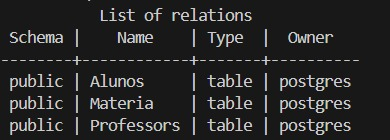

# PROVA
=====================================================================
# Unifaat :: Devweb :: PROVA <a name="Projeto de Sistema de Gerenciamento Escolar Infantil"></a>

#### para executar os comandos pode ser usado o proprio terminal bash do vs code ou o insomnia"

## 📑 Sumário

- [Instalação e Execução](#instalacao-e-execucao)
- [👨‍🔬 Testando API](#Testando-API)
  - [👨‍🎓 Criar um aluno](#criar-aluno)
  - [👨‍🏫 Listar um aluno](#listar-aluno)
  - [👨‍🏫 Criar um professor](#criar-um-professor)
  - [📒 Criar uma materia](#criar-materia)
- [📆 Teste da Tabela (postgreSQL)](#teste-tabela)
- [📚 Bibliotecas Utilizadas](#bibliotecas-utilizadas)
- [🗂 Estrutura do projeto](#estrutura-do-projeto)
- [🎈 docker](#docker)

---

## Instalação e Execução <a name="instalacao-e-execucao"></a>

### Siga os passos abaixo para rodar o projeto via Docker:

1. Clonar o repositório:

   ```sh
   git clone https://github.com/Zone5517/PROVA.git
   ```

2. Configure as variáveis de ambiente no arquivo .env:

   ```sh
    DB_HOST=db
    DB_PORT=5432
    DB_USER=postgres
    DB_PASS=postgres
    DB_NAME=escola
   ```

3. Entrar na pasta do projeto:

   ```sh
   cd "PROVA-MAIN
   ```

4. Instalar as dependências:

   ```sh
   npm install
   ```

5. Subir a aplicação com Docker Compose:

   ```sh
   docker compose up --build
   ```

6. Acesse a API no navegador ou em ferramentas como Insomnia/Postman:

   ```sh
   Acesso à API: 
    Você pode acessar os endpoints da API de duas formas:
    Diretamente via porta do backend Node.js:

    http://localhost:3000

    Através do servidor NGINX (proxy reverso):

    http://localhost:8080
   ```

   ## Acesse <a name="Testando API"></a>

- Servidor: [http://localhost:3000](http://localhost:3000)

---

## 👨‍🔬 Como Criar API <a name="Testando-API"></a>

## 👨‍🎓 Criar um aluno <a name="criar-aluno"></a>

Exemplo
```js
curl -X POST http://localhost:3000/alunos \
  -H "Content-Type: application/json" \
  -d '{"nome":"Lucas","idade":7}'
```

## 👩‍🎓 Listar alunos: <a name="Listar-aluno"></a>

```js
curl http://localhost:3000/alunos
  ...
  # Buscar aluno por ID: cada aluno tem seu id para procurar mude o numero no final do comando /1
  ...
    curl http://localhost:3000/alunos/1 

    # Deletar Aluno por ID: novamente mude o numero no final confrome o id do aluno /1
    ...
    curl -X DELETE http://localhost:3000/alunos/1

```

## 👩‍🏫 Criar um Professor <a name="criar-um-professor"></a>
```js
curl -X POST http://localhost:3000/professores \
  -H "Content-Type: application/json" \
  -d '{"nome": "Ana", "disciplina": "Matemática"}'
```
## 👩‍🏫 Listar professor: <a name="Listar-aluno"></a>

```js
 curl http://localhost:3000/professores

  ...
  # atualizar materia por ID: cada professor tem seu id para procurar mude o numero no final do comando /1 
  e depois escolha a materia de sua preferencia
  ...
    curl -X PUT http://localhost:3000/professores/1 \
  -H "Content-Type: application/json" \
  -d '{"nome":"João", "disciplina":"História"}'

    # Deletar professor por ID: novamente mude o numero no final confrome o id do professor /1
    ...
    curl -X DELETE http://localhost:3000/professore/2
```

## 📒 Criar uma materia: <a name="Criar-materia"></a>

```js
 curl http://localhost:3000/materias
  ...
  # Criar materia  
Substitua os valores conforme necessário:

"nome": nome da matéria.

"carga_horaria": número de horas (por exemplo, 40 ou 60).

  ...
    curl -X POST http://localhost:3000/materias \
  -H "Content-Type: application/json" \
  -d '{"nome":"Matemática", "carga_horaria":40}'

    # Deletar materia por ID: novamente mude o numero no final conforme o id da materia /1
    ...
    curl -X DELETE http://localhost:3000/materias/1
```

  ## 💻 Teste da Tabela  <a name="teste-tabela"></a>
Exemplo
```js
docker ps 
ira listar todos os containers assim precisando copiar o nome que contenha a porta 5433:5432

# em seguida de o comando "docker exec -it  prova-main-db-1 bash" para se conectar a tabela
# apos isso execute "psql -U postgres -d escola" e ira ficar no chat "escola=#"
# e assim escrevendo "\dt" ira mostrar uma tabela com Alunos, Professores e Materia
```
   ## Tabela


```js
 apos isso voce ira conseguir acessar as informações de cada uma com o comando SELECT * FROM "Alunos"; precisando so trocar Alunos por professor ou materia.
```

## 📚 Bibliotecas Utilizadas <a name="bibliotecas-utilizadas"></a>

| Biblioteca            | Finalidade                                                                 |
|-----------------------|----------------------------------------------------------------------------|
| `express`             | 	Framework web para construção de rotas servidores HTTP.        |
| `sequelize`               | ORM para manipulação de banco relacional com JS          |
| `pg`              | Driver PostgreSQL para Node.js     |
| `nodemon`                  | (dev) Reinicia servidor automaticamente no dev |
| `dotenv`           | Carregamento de variáveis de ambiente     |
---

## 🗂 Estrutura do projeto (raiz) <a name="estrutura-do-projeto"></a>

| Caminho / Pasta             | Descrição                                                                                                 |
|-----------------------------|-----------------------------------------------------------------------------------------------------------|
| `APP/`                      |  Pasta principal da aplicação backend                                                     |
| `config/`             | Arquivos de configuração do Sequelize.                |
| `database.js`                 | Conecta ao banco PostgreSQL usando Sequelize                                                                   |
| `controllers/`     |  Contém a lógica das rotas (regras de negócio)                                              |
| `alunoController.js`     | CRUD de Alunos                                                   |
| `professorController.js`                 | CRUD de Professores                   |
| `materiaController.js`               | CRUD de Matérias                                  |
| `models/`                | Models do Sequelize (definem as tabelas)  |
| `aluno.js`                   | Model da tabela "Alunos"             |
| `professor.js`                     | Model da tabela "Professores"                                   |
| `materia.js`           | Model da tabela "Materias"                                                   |
| `routes/`         | Define as rotas da API                                                                    |
| ` alunoRoutes.js`       | Rotas para alunos (/alunos)                                                                   |
| ` professorRoutes.js`            | Rotas para professores (/professores)                                                                        |
| ` materiaRoutes.js`          | RRotas para matérias (/materias)                                                  |
| `docker/`      | Configurações e scripts do PostgreSQL                                                    |
| ` init.sql`           | Script que cria o banco e tabelas ao iniciar o container                                                             |
| `.env`                   | Variáveis de ambiente (porta, banco, senha, etc)                                                   |
| `Dockerfile`                     | Define como a aplicação Node.js será construída                                                          |
| `docker-compose.yml`             | Orquestra os containers (backend + banco de dados)                                                                   |
| `index.js`                   | Arquivo principal que inicia o servidor Express                                      |
| `package.json`                   | Lista de dependências e scripts npm                                      |
| `README.md`                  | Documentação do projeto                                          |

---


## 🎈 Docker <a name="docker"></a>

## ⚙ Containers da Aplicação

| Container               | Dockerfile                             | Função                                                                 | Porta Interna |
|-------------------------|-----------------------------------------|------------------------------------------------------------------------|-------|
| `app (Backend Node.js com Express + Sequelize)`     | `./Dockerfile.app`        |Esse container instala as dependências (npm install), copia os arquivos da API, e executa node index.js | 3000 |
| `db (PostgreSQL 14)`     | `postgres:14 (imagem oficial)`            | Contém o banco de dados PostgreSQL, com nome, usuário e senha definidos nas variáveis de ambiente | 5432 |
| `nginx`  | `nginx:alpine`         | Proxy reverso que encaminha requisições HTTP para o backend na porta 3000                              | 80 |

## 💾 Volumes Persistentes

| Volume                         | Utilizado por                      | Finalidade                                          |
|--------------------------------|------------------------------------|-----------------------------------------------------|
| `pgdata` | `db`  | Persistência dos dados do banco PostgreSQL     |

### 🌐 Redes

Todos os containers estão conectados à rede Docker personalizada:

### 🌍 Portas Expostas Externamente

| Serviço     | Porta Interna | Porta Externa | Acesso Externo                      |
|-------------|----------------|----------------|-------------------------------------|
| NGINX       | 80             | **80**       |   http://localhost               |
| PostgreSQL  | 5432           | **5433**       | utilizado por ORM/CLI               |

[def]: #estrutura-de-diretorios-raiz